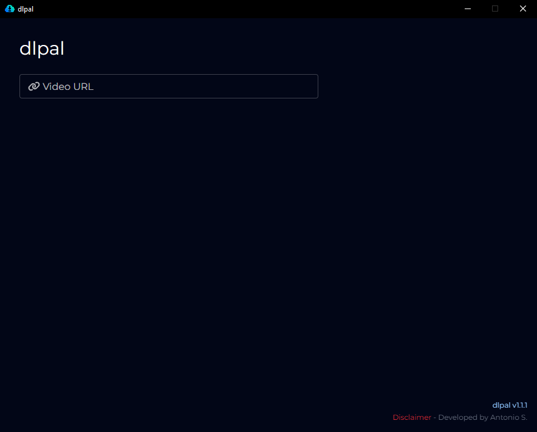
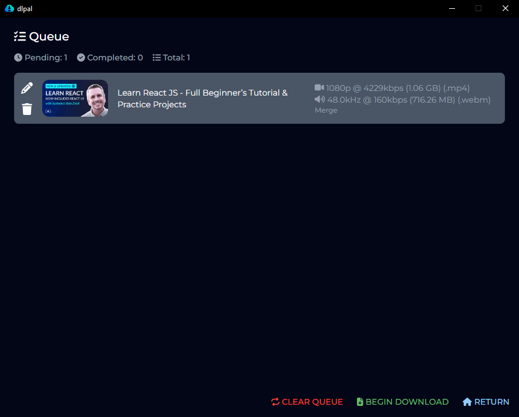

Desktop app made in Electron, React and Tailwind CSS for downloading YouTube long-format videos and shorts. Based on [@distube/ytdl-core](https://www.npmjs.com/package/@distube/ytdl-core) for downloading and [ffmpeg](https://ffmpeg.org/) for converting media.

## Installation

You need to go to the [releases page](https://github.com/anventec/dlpal/releases) and download the setup. Then, all is good to go! Open the app and start downloading!

## Screenshots

### Main menu

### Selector panel

### Download queue

## dlpal works for:

- Long videos [like this](https://www.youtube.com/watch?v=dQw4w9WgXcQ)
- Short [like this](https://www.youtube.com/shorts/SXHMnicI6Pg)

## dlpal DOESN'T work for:

- Playlists *(yet)*
- Private videos
- Geo-restricted videos

## Upcoming features

- [ ] Supporting chapters
- [ ] Supporting playlists
- [ ] Converting video/audio to other formats

## Disclaimer

- **dlpal** will not be held responsible for what end users do with downloaded content.
- **dlpal** do not own nor claim to own the rights to any of the content that end users can download.
- **dlpal** is not associated in any way with YouTube or Google LLC.
- YouTube is a registered trademark of Google LLC.
- **dlpal** is still a work in progress. Bugs are expected.
